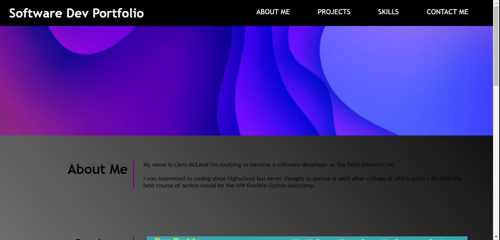

<h1>Professional Portfolio</h1>
<h2> Description </h2>
  
The purpose of this was to create a professional porfolio of which i would be willing to share with future employers 

<h2>Screenshot of the portfolio</h2>
 

  <h2>Contributors</h2>
  
Chris McLeod
    
<h2>Languages used</h2>

html

CSS

 <h2> Deployable Link</h2>
https://chris-mcleod2.github.io/challenge-week1/
<h2> Github Link </h2>
https://github.com/Chris-McLeod2/challenge-week1.git
